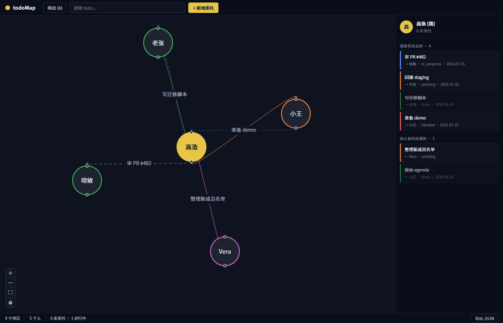

# todoMap

本地桌面应用,把"项目协作网络"画成一张图:节点是人,边是"我委托给 ta 的 todo"或"ta 委托给我的 todo"。同项目的边/节点用同一种颜色。"我"在中心。



## 技术栈

- **Tauri 2** (Rust 2.1, WebView2 on Windows)
- **React 18** + **TypeScript** + **Vite 5**
- **React Flow 11** (画布与拖拽)
- **SQLite** (rusqlite 0.31,本地存储)
- **Vitest** (前端单元测试)
- **rust + cargo test** (后端单元测试)

## 环境要求

| 工具 | 用途 | 安装 |
|---|---|---|
| Node.js ≥ 18 | 前端构建 | [nodejs.org](https://nodejs.org/) |
| Rust (stable) | 编译 Tauri 后端 | [rustup.rs](https://rustup.rs/) |
| MSVC Build Tools | Rust 在 Windows 上的 C 链接器 | [Visual Studio Build Tools](https://visualstudio.microsoft.com/visual-cpp-build-tools/),勾选 "Desktop development with C++" |
| WebView2 Runtime | 渲染前端 (Windows 11 自带) | [Microsoft Edge WebView2](https://developer.microsoft.com/en-us/microsoft-edge/webview2/) |

验证安装:

```
node --version
npm --version
rustc --version
cargo --version
```

## 一次性安装

```
git clone https://github.com/efish2002/todoMap.git
cd todoMap
npm install
```

## 运行 — 三种模式

### 1. 桌面应用 (推荐,功能完整)

```
npm run tauri dev
```

第一次会编译所有 Rust 依赖,约 5–15 分钟;之后增量编译几秒。会弹出一个 1280×800 的桌面窗口,使用本地 SQLite 存储数据,所有改动实时落盘。

### 2. 浏览器预览 (无后端)

```
npm run dev          # Vite dev server on http://localhost:1420
# 或者
npm run build && npm run preview   # 静态预览 on http://localhost:5180
```

预览模式使用 `src/previewData.ts` 里的 mock 数据(高远、李宁、Mira、陈默、Yuki),**不会**持久化——刷新就回到 mock。适合调样式、看图谱。

注意:在预览模式里**点保存会显示错误**(这是预期的,因为没有 Tauri 后端),错误信息明确提示"请在 Tauri 桌面应用中操作"。

### 3. 测试

```
# 前端
npm test

# Rust 后端
cd src-tauri && cargo test
```

## 生产构建 (生成 .exe)

```
npm run tauri build
```

产物在 `src-tauri/target/release/`:

| 路径 | 说明 |
|---|---|
| `todomap.exe` | 单文件可执行(5–10 MB),双击即跑 |
| `bundle/msi/todoMap_0.1.0_x64_en-US.msi` | Windows Installer |
| `bundle/nsis/todoMap_0.1.0_x64-setup.exe` | NSIS 安装包 |
| `bundle/*.dmg` / `*.app` (在 macOS 机器上) | macOS 安装包 |
| `bundle/*.deb` / `*.AppImage` (在 Linux 机器上) | Linux 包 |

> 注意: 当前沙箱机器未装 Rust 工具链,所以 `npm run tauri dev` / `npm run tauri build` 在这里跑不起来。请在你**自己的 Windows 机器**上构建。

## 使用小贴士

- **新建项目**: 顶栏右上角的 `+ 新建项目` (任何时候都可点,包括空状态)
- **新建 todo**: `+ 新增请求` (需要先有项目)
- **编辑我**: 顶栏 `● 编辑我`,或双击中心的"我"节点
- **编辑别人**: 双击任意人名节点
- **拖动节点**: 按住人名节点拖到任意位置,松开后位置**持久化到 localStorage**
- **导出**: 状态栏的 `导出 JSON` 按钮——下载一个 `.json` 备份
- **按状态着色**: 蓝=待办,橙=进行中(带流动动画),绿=已完成(虚线),红=阻塞(点线)
- **悬停聚焦**: 鼠标悬停某节点时,其他节点和边淡出,便于看清与此人的关系

## 数据存储

桌面模式下,数据存在本地 SQLite:

- Windows: `%APPDATA%\com.todomap\app\`
- macOS: `~/Library/Application Support/com.todomap/`
- Linux: `~/.local/share/com.todomap/`

应用内置"导出 JSON" 把全量数据下载到一个 `.json` 文件,可作为备份或迁移。

## 故障排查

### "Cannot read properties of undefined (reading 'invoke')"

原因: 浏览器里跑 (没装 Tauri 容器)。  
解决: 用 `npm run tauri dev` 启动桌面窗口,或者接受预览模式不能保存的限制。

### vite build 时 CSS 报 "Unexpected '}'"

原因: lightningcss 比 esbuild 严格,会在 `styles.css` 里捕捉到孤立的 `}`。  
解决: `npm install lightningcss` 让 vite 用相同的 parser,报错的 `loc.line` 那一行附近,通常有手改残留的 `}`。`git diff src/styles.css` 检查最近改动。

### 拖动节点没反应 / 双击编辑没反应

原因: ReactFlow 节点需要先"鼠标按下"再"释放"才会触发 onNodeDragStop;快速双击(间隔 < 250ms)才会触发 onNodeDoubleClick。  
解决: 慢一点按住拖,慢一点双击。如果还是不行,清一下 `localStorage.todomap.userPositions` 重置节点位置。

### 中文乱码

原因: PowerShell 5.1 默认 GBK codepage 写文件。  
解决: 编辑源文件用 VSCode (默认 UTF-8),或者 `Set-Content -Encoding UTF8` 之后用 `python` 重新写一次去 BOM。

## 文档

- 设计: [docs/superpowers/specs/2026-07-01-todoMap-design.md](docs/superpowers/specs/2026-07-01-todoMap-design.md)
- 实施计划: [docs/superpowers/plans/2026-07-01-todoMap-implementation.md](docs/superpowers/plans/2026-07-01-todoMap-implementation.md)
- 已修复 issue: [GitHub Issues](https://github.com/efish2002/todoMap/issues?q=is%3Aissue+is%3Aclosed)
